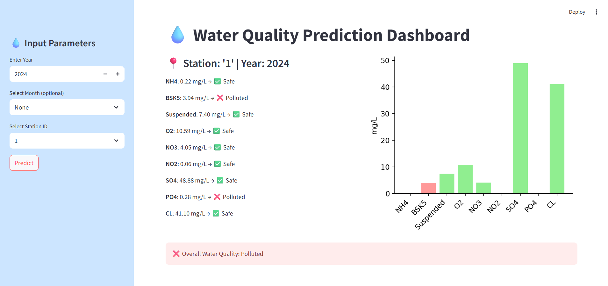

# 💧 Water Quality Prediction – RMS

**AICTE 4-Week Virtual Internship Project (June 2025 – Sponsored by Shell)**
This project aims to predict **multiple water quality parameters** using machine learning, helping identify pollution trends and classify water as **Safe** or **Polluted** based on environmental safety standards. The core model uses a **RandomForestRegressor wrapped with MultiOutputRegressor**, trained on real-world data from **22 river monitoring stations** along the Southern Bug River.

## 1. Project Motivation
Access to safe water is a critical global challenge — over 2 billion people lack access to safely managed drinking water (WHO, 2023).
Traditional water monitoring is manual and slow, often reactive rather than proactive.
This project aims to build an intelligent, predictive system to enable **early detection** of water pollution and support **data-driven environmental decision-making**.

## 1. Key Features

| Stage              | Enhancements                                                                                   |
| ------------------ | ---------------------------------------------------------------------------------------------- |
| **Data Cleaning**  | Handled missing values using **KNNImputer** and removed outliers using the **IQR method**      |
| **Features**       | Extracted `year` and `month`; applied **one-hot encoding** on `station ID`                     |
| **Model Tuning**   | Used **RandomizedSearchCV** for hyperparameter optimization with cross-validation              |
| **Classification** | Compared predictions against **WHO/EPA thresholds** to classify each pollutant (Safe/Polluted) |
| **Dashboard**      | Built an interactive **Streamlit app** for real-time predictions and visual pollutant insights |

## 3. Tech Stack

- **Python 3.12**
- **Pandas & NumPy** – Data processing and manipulation
- **Scikit-learn** – ML modeling, evaluation, and tuning
- **Matplotlib & Seaborn** – Visualization and EDA
- **Streamlit** – Real-time web app dashboard
- **Joblib** – Model serialization for deployment
- **Colab Notebook** – Development environment

## 4. Pollutants Predicted

The model predicts 9 major water quality parameters such as:

- NH4
- BOD5 (BSK5)
- Suspended Solids
- O2, NO3, NO2, SO4, PO4 
- CL

## 5. Model Performance

Evaluated using **R²**, **MSE**, and **MAE** for each pollutant:

| Pollutant | R² Score | MSE    | MAE   |
| --------- | -------- | ------ | ----- |
| NH₄       | 0.354    | 0.03   | 0.12  |
| BSK5      | 0.356    | 3.71   | 1.48  |
| Suspended | 0.317    | 17.53  | 3.20  |
| O₂        | 0.374    | 6.83   | 2.00  |
| NO₃       | 0.465    | 3.41   | 1.39  |
| NO₂       | 0.235    | 0.00   | 0.03  |
| SO₄       | 0.659    | 258.95 | 11.37 |
| PO₄       | 0.295    | 0.05   | 0.15  |
| Cl        | 0.697    | 37.62  | 4.78  |

## 6. Classification Logic

Predicted pollutant levels are compared against WHO/EPA thresholds:
 - ✅ If within safe limit → <em>Safe</em>
 - ❌ If exceeding threshold → <em>Polluted</em>

Final water quality is classified accordingly in the dashboard.

## 7. Streamlit Dashboard Features

- Input: Year, Station ID, optional Month
- Output:
    - Predicted pollutant levels
    - Safety classification per parameter
    - Overall water status: **Safe / Polluted**
    - Bar chart visualization with color-coded safety status
 

## 8. Trained Model Link

-- https://drive.google.com/file/d/18M2v-oehVrtcaVChYFhXqz4unmGMNYtH/view?usp=drive_link

## 9. Internship Details

| Field         | Details                                       |
| ------------- | --------------------------------------------- |
| **Programme** | AICTE Virtual Internship – Edunet Foundation  |
| **Sponsor**   | Shell                                         |
| **Duration**  | June 2025 (1 month)                           |
| **Focus**     | Machine Learning for Environmental Monitoring |

---
